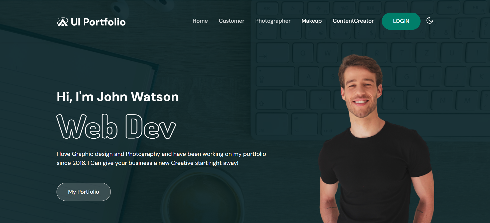
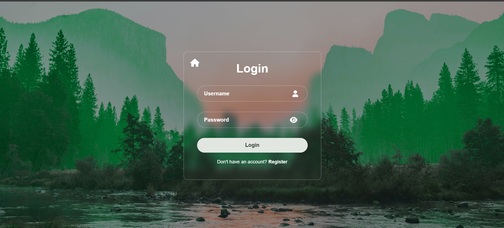
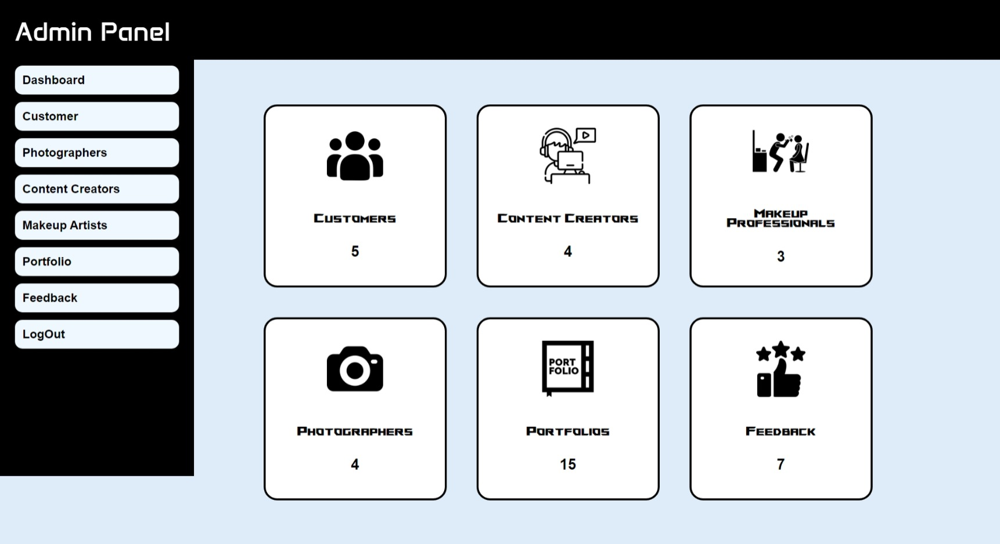
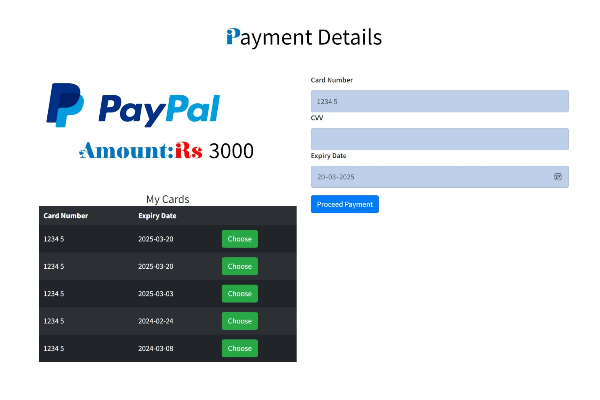

<div align="center">

# 🎨 Digital Portfolio Store

### **A Full-Stack Django Platform for Creative Professionals**

<p align="center">

Create • Showcase • Connect • Collaborate

</p>

<p align="center">


</p>

---

### 🌟 A Complete Digital Portfolio Management Platform

Helping **Photographers**, **Makeup Artists**, **Content Creators**, and **Customers** collaborate through one centralized web application.

</div>

---

# 🚀 About The Project

Digital Portfolio Store is a **multi-role portfolio management platform** developed using **Python** and **Django**.

The system provides a centralized platform where creative professionals can showcase their work while customers can browse portfolios, request services, monitor project progress, complete secure payments, and provide valuable feedback.

Unlike a traditional portfolio website, this platform manages the **entire workflow** of a digital portfolio project—from booking to final delivery.

---

# ✨ Key Highlights

- 👥 Multi-Role Authentication System
- 📂 Portfolio Management
- 📅 Appointment Management
- 💳 Payment Module
- ⭐ Feedback System
- 📈 Progress Tracking
- 👨‍💼 Admin Dashboard
- 📱 Responsive Interface
- 🔐 Secure Login System
- 📄 File Upload Support

---

# 👥 User Roles

| Role | Description |
|------|-------------|
| 👨‍💼 Administrator | Controls the entire platform, manages users, portfolios, payments and feedback |
| 👤 Customer | Creates portfolio requests, tracks projects and makes payments |
| 📸 Photographer | Handles photography work and project assignments |
| 💄 Makeup Artist | Provides makeup services for portfolio creation |
| 🎬 Content Creator | Finalizes portfolio, uploads files and manages project completion |

---

# 🏗️ Complete Workflow

```text
                    Customer
                        │
                        ▼
           Creates Portfolio Request
                        │
                        ▼
             Photographer Assigned
                        │
                        ▼
            Makeup Artist Assigned
                        │
                        ▼
          Content Creator Assigned
                        │
                        ▼
              Portfolio Development
                        │
                        ▼
             Progress Tracking (0-100%)
                        │
                        ▼
                  Payment Module
                        │
                        ▼
              Project Successfully Delivered
                        │
                        ▼
                Customer Feedback
```

---

# 🎯 Core Modules

| Module | Description |
|---------|-------------|
| 👤 User Management | Registration, Login & Authentication |
| 📂 Portfolio Management | Create & Manage Portfolios |
| 📅 Appointment Management | Assign Professionals |
| 📨 Request Management | Customer Requests |
| 💳 Payment Management | Handle Payments |
| ⭐ Feedback System | Customer Reviews |
| ✅ Verification System | Admin Approval Process |

---

# 🛠️ Technology Stack

| Category | Technologies |
|----------|--------------|
| 💻 Backend | Python, Django |
| 🎨 Frontend | HTML5, CSS3, Bootstrap, JavaScript |
| 🗄 Database | SQLite |
| 🔐 Authentication | Django Authentication |
| 📁 File Storage | Django File Storage |
| 🧰 Version Control | Git |
| ☁ Repository | GitHub |

---

# 📊 Project Statistics

| Feature | Count |
|---------|------:|
| 👥 User Roles | **5** |
| 🗂 Database Models | **8** |
| 📄 HTML Templates | **35+** |
| ⚙ Views | **50+** |
| 📁 Static Assets | **300+** |
| 📦 CRUD Operations | **Complete** |
| 💳 Payment Module | ✅ |
| ⭐ Feedback Module | ✅ |
| 📈 Progress Tracking | ✅ |

---

# 📸 Application Preview

## 🏠 Landing Page

<p align="center">

</p>

---

## 🔐 Login Page

<p align="center">

</p>

---


## 👨‍💼 Administrator Dashboard

<p align="center">

</p>

---


## 💳 Payment Module

<p align="center">

</p>

---


# 🏛️ System Architecture

```text
                        ┌──────────────────────┐
                        │      Customer        │
                        └──────────┬───────────┘
                                   │
                          Portfolio Request
                                   │
              ┌────────────────────┼────────────────────┐
              ▼                    ▼                    ▼
       Photographer         Makeup Artist      Content Creator
              │                    │                    │
              └──────────────┬─────┴──────────────┬─────┘
                             ▼
                      Portfolio Management
                             │
                             ▼
                     Progress Monitoring
                             │
                             ▼
                       Payment Processing
                             │
                             ▼
                      Feedback & Ratings
                             │
                             ▼
                         Administrator
```

---

# 📂 Project Structure

```text
Digital Portfolio Store
│
├── portfolio/
│   ├── settings.py
│   ├── urls.py
│   ├── wsgi.py
│   └── asgi.py
│
├── portfolioApp/
│   ├── models.py
│   ├── views.py
│   ├── admin.py
│   ├── migrations/
│   └── apps.py
│
├── template/
├── static/
├── manage.py
├── requirements.txt
└── README.md
```

---

# ⚡ Quick Start

## 1️⃣ Clone the Repository

```bash
git clone https://github.com/Athul-27/digital-portfolio-store.git
```

---

## 2️⃣ Navigate to the Project

```bash
cd digital-portfolio-store
```

---

## 3️⃣ Create a Virtual Environment

Windows

```bash
python -m venv venv
venv\Scripts\activate
```

Linux / macOS

```bash
python3 -m venv venv
source venv/bin/activate
```

---

## 4️⃣ Install Dependencies

```bash
pip install -r requirements.txt
```

---

## 5️⃣ Apply Migrations

```bash
python manage.py migrate
```

---

## 6️⃣ Start Development Server

```bash
python manage.py runserver
```

---

## 🌍 Open in Browser

```
http://127.0.0.1:8000/
```

---

# 🔑 Authentication Flow

```text
                    Login
                      │
        ┌─────────────┼──────────────┐
        ▼             ▼              ▼
     Customer     Administrator   Professionals
        │             │              │
        ▼             ▼              ▼
  Customer Home   Admin Panel    Individual Dashboard
```

---

# 💾 Database Design

The application uses **SQLite** as its relational database.

### Main Database Models

- 👤 CustomUser
- 👤 Customer
- 📸 Photographer
- 💄 Makeup Artist
- 🎬 Content Creator
- 📂 Portfolio
- 💳 Payment
- 💳 Card
- ⭐ Feedback

---

# 🔥 Major Functionalities

✔ User Authentication

✔ Multi-role Access Control

✔ Portfolio Request Management

✔ Portfolio Assignment

✔ Progress Tracking

✔ Portfolio Upload

✔ File Management

✔ Payment Handling

✔ Feedback Collection

✔ Admin Monitoring

---

# 🎯 Challenges Solved

- Centralized portfolio management
- Easy communication between creators and customers
- Digital workflow management
- Organized payment tracking
- Portfolio approval system
- Better customer experience
- Reduced manual work

---

# 🚀 Future Scope

- 🤖 AI Portfolio Recommendations
- 💬 Live Chat
- 📧 Email Notifications
- 📱 Android & iOS App
- 🌐 REST API
- ☁ Cloud Deployment
- 🔔 Push Notifications
- 🔍 Advanced Search & Filters
- ❤️ Wishlist Feature
- 🌍 Multi-language Support
- 💵 Online Payment Gateway Integration

---

# 📚 What I Learned

During the development of this project, I gained hands-on experience in:

- Django Framework
- Python Programming
- CRUD Operations
- Django Authentication
- File Upload Handling
- SQLite Database Design
- Session Management
- Role-Based Authentication
- Frontend Development
- Git & GitHub
- MVC Architecture
- Project Deployment Workflow

---

# 📈 Project Summary

| Feature | Status |
|----------|:------:|
| User Authentication | ✅ |
| Portfolio Management | ✅ |
| Appointment Management | ✅ |
| Payment Module | ✅ |
| Progress Tracking | ✅ |
| Feedback System | ✅ |
| Responsive Design | ✅ |
| Admin Dashboard | ✅ |

---

# 📌 Repository Information

```text
Project Name   : Digital Portfolio Store
Project Type   : Full Stack Web Application
Framework      : Django
Language       : Python
Database       : SQLite
Version        : 1.0
Status         : Completed
```

---

# 🤝 Contributing

Contributions, issues and feature requests are welcome.

If you'd like to improve this project:

1. Fork the repository
2. Create your feature branch

```bash
git checkout -b feature/NewFeature
```

3. Commit your changes

```bash
git commit -m "Added New Feature"
```

4. Push to the branch

```bash
git push origin feature/NewFeature
```

5. Open a Pull Request

---

# 👨‍💻 Developer

<div align="center">

## Athul S

Python Developer • Django Developer

GitHub

https://github.com/Athul-27

</div>

---
